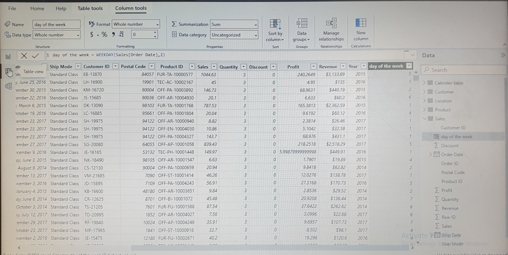
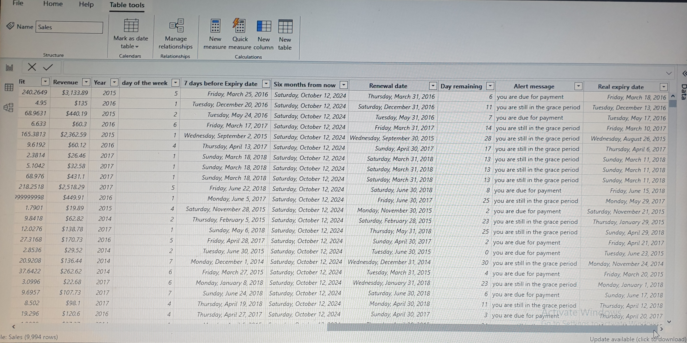
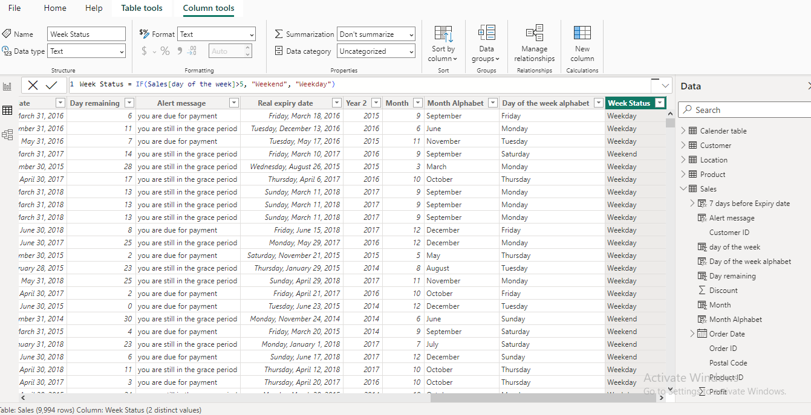
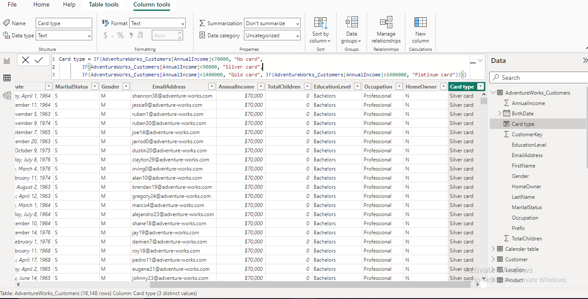

# Exploring DAX in Power BI - Project Overview
Welcome to my GitHub repository which is dedicated to examine various case studies of Data Analysis Expressions (DAX) in Power BI. This project aims to showcase the practical application of DAX formulas for data modeling,analysis and visualization within the Power BI environment.

## Project Scope:
Objective: This is to analyze and demonstrate the use of DAX functions in real world scenarios through through case studies.
Tool: Microsoft Power BI will be utilized for implementing DAX formulas and visulizing the results.
Case Studies: I will present multiple case studies showcasing the versatility and power of DAX in solving analytical challenges.

## Key Features:
1. Case Study Selection: Curate a diverse set of case studies highlighting different aspects of DAX functions.
2. DAX Implementation: Demonstrate the step by step application of DAX.

   ### Case Studies A
   
   ## Calculated Columns Project:
   #### Weekday Function:
Problem Statement:
Determine the total number of orders placed based on the day of the week, starting from Monday to Sunday.

Code: Day of the week = WEEKDAY(sales(orderDate),2

2 represent Monday=1 through Sunday =7
   

   
  #### Edate Function:
Problem Statement:
Determine the service expiry of a product whose validity is 6 months from the date of ordering.

Code: Expiry date = EDATE(sales(orderDate),6

6 represent months from the date of ordering
  

#### Emonth Function:
Problem Statement:
Determine the due date to renew the service which expires in 6 months and the last date to renew the service falls on the last day of that month.

Code: Six months from now = EDATE(Today(),6)
  

#### Date difference and Today Function:
Problem Statement:
Determine the age of a customer as of today based on the date of birth provided by the customer.

Code: Alert message = If(sales(days remaining)<10, "you are due", "you are still in the grace period")
  

### Case Studies B
   ## Logical Functions Project:

Problem Statement:
Map the dates in the sales table to it corresponding day of the week.
Monday to Friday = Weekday
Saturday and Sunday = Weekend

Code: Week status = Code: Week status =IF(Sales(day of the week)>5, “weekend”, “weekday”)
 

Nested IF
Problem Statement: 
Based on the annual income, customer is eligible for membership cards as per the criteria below…
<70000 = No card
<90000 = Silver card
<140000 = Gold card 
>140000 = Platinum card

Code: Card type = IF(AdventureWorks_Customers[AnnualIncome]<70000, "No card", 
        IF(AdventureWorks_Customers[AnnualIncome]<90000, "Silver card",
        IF(AdventureWorks_Customers[AnnualIncome]<1400000, "Gold card", 
	IF(AdventureWorks_Customers[AnnualIncome]>1400000, "Platinum card"))))

   

 

